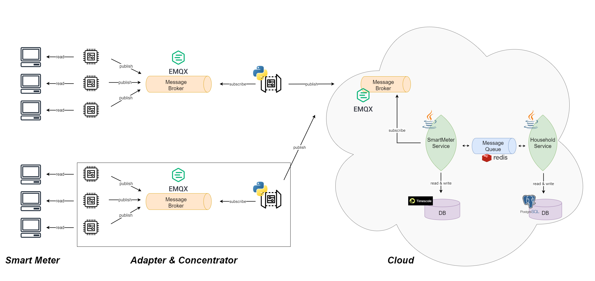

# Architectural Decisions

This is the entrypoint for the technical documentation of our sample implementation of the [specification](../../specification/). Here, we give an overview about our system as well as the architectral decision that led to the system design.

## Role of System Components

The system architecture of our implementation can be seen in the drawing below. According to the specification, there should be four components: Smart Meter, Smart Meter Adapter, Concentrator, Cloud. We adhered to this structure, with the exception that the Adapter and Concentrator functionality is executed on the same device.

### Smart Meter

The Smart Meter - provided by our univserity - measures the energy cunsmption at a given time-frame. These Smart Meters are usually installed in each household.

### Adapter & Concentrator

The core functionality of an `Adapter` is to map the collected data to the standardised data format so that the `Concentrator` (and later on the `Cloud`) and process it accordingly. The specification recommends to place the Adapter on an own device. We would have put it on the hardware module that reads the data (via M-Bus). But since such a hardware module was provided to us, we couldn't do that. Thus, we decided to use one device for the Adapter and Concentrator functionality, which is also allowed by the specification.

Essentially, this component listens to a MQTT topic to which the hardware module sends messages containing `voltage` and `current`. Then, these messages are transformed to the according format and published to the MQTT broker lying between the Concentrator and Cloud. For further details, we refer to the sub-chapter [Adapter & Concentrator](adapter-and-concentrator/Adapter_Concentrator.md).

### Cloud

The core feature of the Cloud component are data storage and providing access to the data.

The `Smartmeter microservice` is subscribed to topcis of the MQTT broker. The incoming messages are eventually persisted in a TimescaleDB.

The `Household microservice` offers basic features such as creating and requesting households and users.

For further details, we refer to the sub-chapter [Smartmeter Service](smartmeter-service/Smartmeter_Service.md).

### Mobile Application

If you want to learn more about the mobile application, please refer to the sub-chapter [Mobile Application](mobile-app/Mobile_App.md).

## Scenarios

One of the first design decision was about the interface between the Concentrator and Cloud. We played through three scenarios.

### Scenario 1: Concentrator pushes to Cloud via HTTP (synchronous)

* As soon as the Concentrator receives new data, it pushes to the REST API of the Cloud
* Then, the data is persited in the Cloud
* Concentrator waits until it receives a response

_Pros:_

* Simple to use
* No need for intermediate broker

_Cons:_

* Availability

### Scenario 2: Concentrator pushes to Cloud via HTTP (asynchronous)

* As soon as Concentrator receives new data, it pushes to REST API of Cloud
* Concentrator does not block until response is delivered
* Cloud persists data whenenver it is ready
* Afterwards, cloud responds to Concentrator that data was persited

_Pros:_

* Non-blocking Concentrator

_Cons:_

* Complexity because of knowledge of recipients

### Scenario 3: Communication via Broker

* Concentrator publishes messages to a topic managed by a broker
* Cloud subscribes to broker, therefore is notified whenever new messages come in.
* MQTT could be used as an example

_Pros:_

* Loose coupling between Concentrator and Cloud
* Availability: Concentrator does not wait for response from Cloud

_Cons:_

* Guarenteed delivery challenge

**Ultimately, we decided to go with a Publish-Subscribe pattern via MQTTS as described in Scenario 3 because of the benefits of loose coupling and availability. This design decision was also one of the reasons why we put Publish-Subscribe pattern in the specification regarding the communication between Concentrator and Cloud components.**
