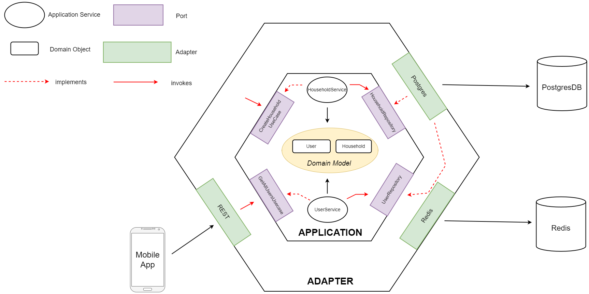

# Household Service

The `Household microservice` is one of the essential parts of the Cloud architecture as it is responsible for data about Households and Users.

## Core Functionality

The core functionality of this service revolves around the following aspects:

- Reliably storing households and users
- Requesting households of a user

## Domain Model

## Hexagonal Architecture

Our goal was to build the smart meter service in a way that enables different external components to interact with our business logic, while keeping the business logic isolated from any external dependencies. So, the decision fell to a `Hexagonal Architecture`, also commonly known as `Ports and Adapters` pattern.

Consequently, we divided the implementation of the smart meter service into two parts. The first part is the _application (inner hexagon)_ that handles the business logic through the domain model and ports. The second part is represented by the _adapters (outer hexagon)_ that use the ports to interact with the business logic. In the illustration below, an extract ofr our hexagonal architecture can be seen.

### Application (inner hexagon)

The inner hexagon is the heart of the infrastructure. It knows about the domain model and business logic. The ports are technology-agnostic interfaces between the system and the outside world that have been designed for a particular purpose.

In our case, for instance, there is a port called `CreateHouseholdUsecase` that takes values for a new `Household` and return the respective ID after persisting the reading. These types of parts are called inbound ports. We added one port per feature. The implementation of these inbound ports are also in the application-hexagon. The `HouseholdService` is an example for that.

The `repository` interfaces represent our outbound ports, which are invoked by the application logic to execute operations to the outside world.

Furthermore, our inner hexagon is completely free from external dependencies - with the exception of few Spring annotations. We could have easily put those Spring annotations to a seperate package outside of the inner hexagon as well, though.

### Adapter (outer hexagon)

An adapter allows interaction through a particular port using a particular technology.

#### Postgres Adapter

The `Postgres` adapters implement the repository interface to save and fetch from our Postgres database. Internally, they delegate most of the requests to the respective JPA repositories, which are provided by Spring to simplify basic operations to the underlying database.

#### Redis Adapter

Apart from that we also implemented a `Redis-Adapter` that publishes `HouseholdEvents`.

#### Rest Adapter

The Rest adapters allow to access the service via HTTP. The applications offers endpoints to create households and users, list the households and users, map users to households and assign meters to housholds.
