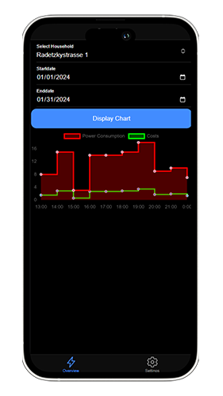
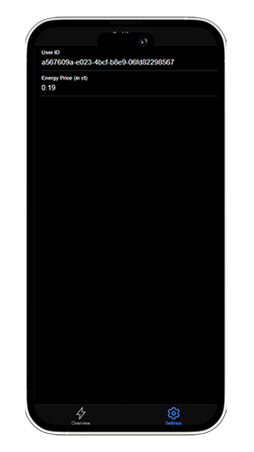

# Mobile App

The `Mobile App` is part of our demo implementation to demonstrate the possibility to access the system.

## Core Functionality

The core functionality of the mobile app revolves around the following aspects:

- Displaying a chart with the power consumption and costs
- Selecting the different households from a user

## Views

The mobile application consists of two different views.

### Overview

The overview page allows to select a household as well as a timespan to visualize to data.

### Settings View

The settings page allows to set a user ID and the energy prices.

## Technology

To implement the application the framework Ionic is used, which is based on Angular.
