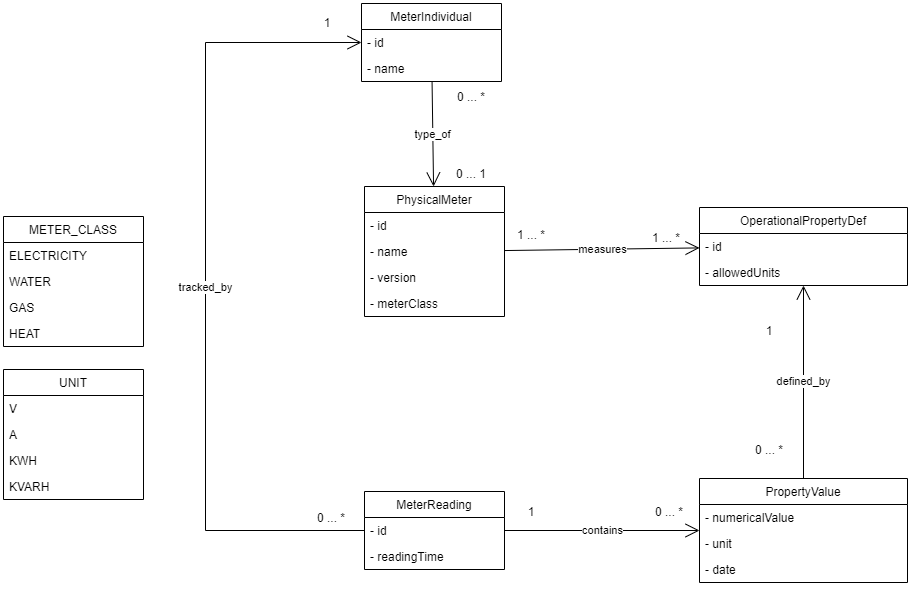
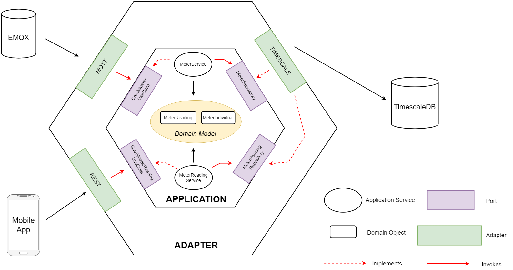

# Smartmeter Service

The `Smartmeter microservice` is one of the essential parts of the Cloud architecture as it is responsible for data about Smart Meter and Meter Readings.

## Core functionality

The core functionality of this service revolves around the following aspects:

- Reliably storing smart meters and meter readings
- Requesting meter readings of a household for a given time interval

## Domain Model

For modelling the domain, we adhered to the data model as proposed by the specification. One crucial relation is depicted by the `MeterReading` containing multiple `PropertyValues`. Every PropertyValue is defined by a _OperationalPropertyDef_. An example for an identifier of such a property definition would be `52.7.0`, which holds the **Instantaneous voltage in phase L2**.

## Hexagonal Architecture

Our goal was to build the Smartmeter service in a way that enables different external components to interact with our business logic, while keeping the business logic isolated from any external dependencies. So, the decision fell to a `Hexagonal Architecture`, also commonly known as `Ports and Adapters` pattern.

Consequently, we divided the implementation of the Smartmeter service into two parts. The first part is the _application (inner hexagon)_ that handles the business logic through the domain model and ports. The second part is represented by the _adapters (outer hexagon)_ that use the ports to interact with the business logic. In the illustration below, an extract ofr our hexagonal architecture can be seen.

### Application (inner hexagon)

The inner hexagon is the heart of the infrastructure. It knows about the domain model and business logic. The ports are technology-agnostic interfaces between the system and the outside world that have been designed for a particular purpose.

In our case, for instance, there is a port called `CreateMeterReadingUseCase` that takes values for a new `MeterReading` and return the respective ID after persisting the reading. These types of parts are called inbound ports. We added one port per feature. The implementation of these inbound ports are also in the application-hexagon. The `MeterReadingService` is an example for that.

The `repository` interfaces represent our outbound ports, which are invoked by the application logic to execute operations to the outside world.

Furthermore, our inner hexagon is completely free from external dependencies - with the exception of few Spring annotations. We could have easily put those Spring annotations to a seperate package outside of the inner hexagon as well, though.

### Adapter (outer hexagon)

An adapter allows interaction through a particular port using a particular technology.

#### MQTT Adapter

One important adapter is the `MQTT-Adapter`, which is basically a subscriber to the EMQX-Broker. Whenever it receives a new meter reading message, the message is parsed and the `CreateMeterReadingUseCase` is used to store the data.

#### TimescaleDB Adapter

The `TimescaleDB` adapters implement the repository interface to save and fetch from our Timescale database. Internally, they delegete most of the requests to the respective JPA repositories, which are provided by Spring to simplify basic operations to the underlying database.

#### Redis Adapter

Apart from that we also implemented a `Redis-Adapter` that listens for `HouseholdEvents`. For example, after a `MeterAssignedEvent` is sent by the Household microservice, the Smartmeter service updates the respective `householdId` field of the Smart Meter.

Finally, we want to note that our objective was not to develop a fully Domain-Driven-Design pattern, despite the fact that you might recognise some DDD patterns in the implementation. We rather wanted to develop a "clean" Hexagonal Architecture.

## Technology Stack

- Spring Boot
- HIbernate
- TimescaleDB
- Redis Streams
