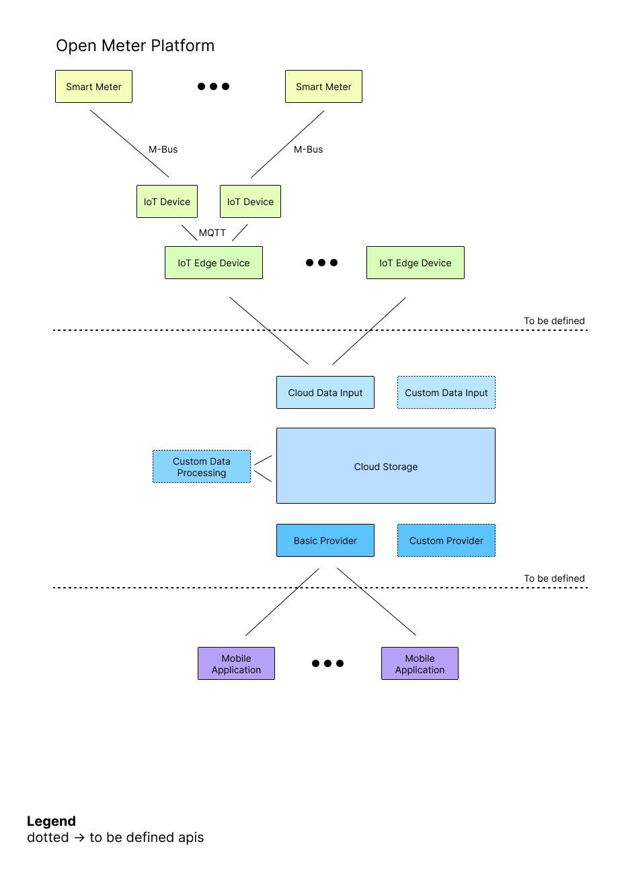
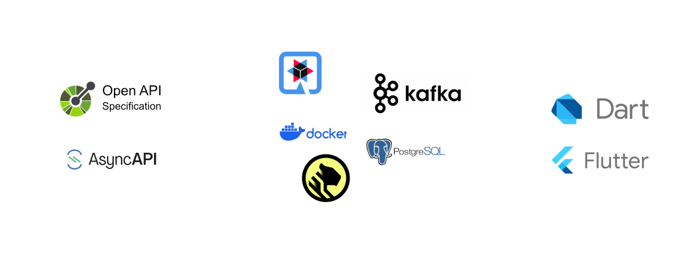

## Open Meter Platform

### Smart Meter

Our smart meter model is the Kaifa MA309M, and it utilizes M-Bus technology to collect data.

### IoT Edge Device

We currently have one IoT Edge Device that is connected with the smart meter through M-Bus. It's worth noting that this device has two connectivity options:

1. The device can directly connect to the cloud, but this approach raises security concerns with our provided device.

2. Alternatively, we can opt to develop an additional local IoT Edge Device that securely connects to the provided device and then communicates with the cloud. 

The decision to employ an additional IoT Edge Device will be a critical aspect of our design process.

Furthermore, it's crucial to outline non-functional requirements for the APIs, including considerations such as efficiency, transport security, and other relevant factors.

### Cloud

Within the cloud environment, there are fundamental components in place:

- **Ingress**: This serves as the entry point for data into our cloud infrastructure.

- **Data Storage with Kafka Message Queue**: We utilize a robust data storage system coupled with a Kafka message queue for efficient and scalable data handling.

- **Basic Data Output API**: Our basic data output API provides access to processed data in a standardized format.

In the context of a more advanced system, the platform should possess the capability to expand according to specific requirements of a future user:

- **Custom Data Input**: The system should support the inclusion of custom data input, allowing the IoT Edge Device to transmit data via an own API to this module in the cloud.

- **Custom Data Processing**: Developers should be able to create a custom data processing solution with direct access to the data storage and message queue.

- **Custom Output APIs**: For creating custom views and unique data presentations, the system should facilitate the creation of custom output APIs.

## Visualizing Applications

In its basic form, a visualizing application can make use of the provided basic API to access and display data.

For more advanced solutions, the platform provides **Utilization of Custom Cloud APIs** opens the door to creating highly sophisticated and tailored applications that leverage the full spectrum of data and services offered by the platform. Advanced applications can thus offer unique and specialized visualization experiences.

## Technologies

We have carefully selected a robust technology stack for this project. Our chosen technologies are as follows:

## Planned Features

- robust & well-documented interfaces
- re-usable & extensible
- 3 interfaces allowing to create extensions for the system
- continuous tracking of power costs as a Demo mobile app