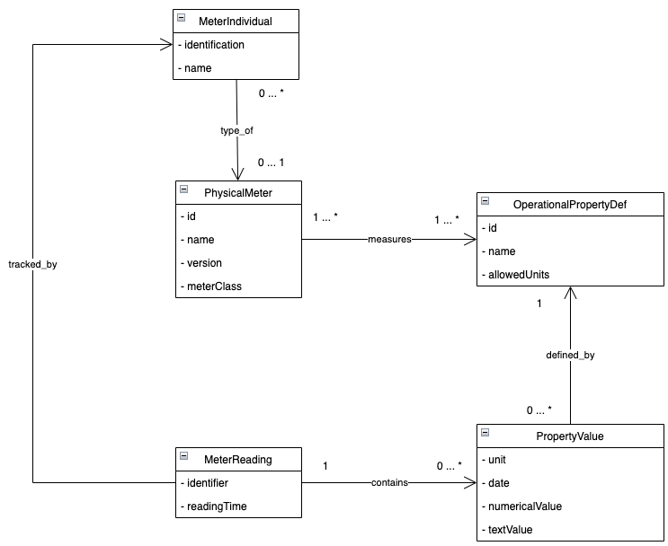

# DataModel

The Data Transmission Format was inspired by a project from the Swedish Defence Materiel Administration.

The specification comprises a SysML Block that represents the template and an associated Parametric Diagram that defines the templates and Platform specific objects instantiated by the MeterReading template.

[Template MeterReading](http://www.plcs.org/plcslib/plcslib/data/contexts/SwedishDefence/templates/MeterReading/template.html)

The Swedish Defence Materiel Administration provides a diagram of the data structure used in the system. Because the whole structure is to specific and not needed in this detail, we have reduced it to the following subset that SHOULD be implemented in this system. The following image shows this subset.

[Full Diagram](http://www.plcs.org/plcslib/plcslib/data/contexts/SwedishDefence/dexs/OperationalData/dex_business_information_model.html#Model_Diagrams)

## The components of the data model

The different parts of this for us interesting subset are described in the next sub chapters.

### MeterReading

The _MeterReading_ specifies a specific MeterReading from one _MeterIndividual_. This element MUST consists of an id and the reading time!

### PropertyValue

The _PropertyValue_ is a flexible element of this specification and for one _MeterReading_ multiple _PropertyValue's_ MAY exist. A _PropertyValue_ MUST consist of a value and SHOULD also contain a unit if applicable.

### OperationalPropertyDefinition

A single _PropertyValue_ belongs to a overall category, in order to combine the same properties from different meter readings. The _OperationalPropertyDefinition_ MUST define an ID and SHOULD define a name. It MAY specify allowed units and a description.

> [!NOTE]
> The purpose of an OperationalProperty is to make the same values from different sources comparable. Two SmartMeter's measuring the same value should use the same property.

### PhysicalMeterElement

A generation of SmartMeter's from the same Manufacturer offering the same OperationalProperty's SHOULD be considered as one _PhysicalMeterElement_. A _PhysicalMeterElement_ MUST specify the set of _OperationalProperty's_ the _PhysicalMeterElement_ can provide. The _PhysicalMeterElement_ SHOULD also specify meta information about the SmartMeter it represents such as a name and a description.

### MeterIndividual

A _MeterIndividual_ is a actual individual device which can be identified individually. It is an instance of a _PhysicalMeterElement_.

## Actual Implementation of the data model

In the following document, the MeterReading is visualized as a yaml structure.

With this yaml based structure json structures can be generated, to get a feeling of how data will be available from different smart meter types. 

For the first example consider a electrical smart meter capable of measuring different phases. When different types of devices would support different set's of property values, they would still be comparable due to the grouping of property values by the _OperationalPropertyDefinition_.

MeterReading Example with electrical readings

The same concept can be used for a water smart meter.

MeterReading Example with water readings

