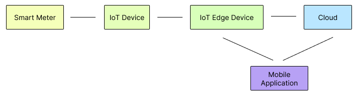
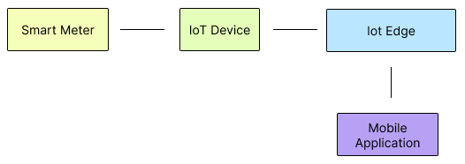

# Technical Specification: Architectural Options

## Introduction

This document outlines various architectural options for a Open Meter Data Platform and describes the components, interactions, and potential use cases from a high level view. In these options, components are merged together in order to reach different architectural goals.

## Completely Divided Architecture

### Overview
The completely divided architecture presents a system configuration in which components are isolated to serve specific functions. This architecture is illustrated in Figure 1.

### Component Descriptions
- **Smart Meter:** Located in the top left, it functions as a standalone component.
- **IoT Device:** Serves as an intermediary between the smart meter and the IoT Edge Device.
- **IoT Edge Device:** Connects to both the Cloud and a Mobile application.
- **Cloud:** Responsible for collecting data and performing heavy calculations. 
- **Mobile Application:** Connects to both the IoT Edge Device and the Cloud. It presents information to the user in a usable form.

## One IoT (Edge) Device

### Overview
In this scenario, the architecture includes a single IoT (Edge) Device that communicates directly with the smart meter and the Cloud, eliminating the intermediary IoT Device. This configuration is illustrated in Figure 2.

 Device")

### Component Descriptions
- **Smart Meter:** Remains the same as in the completely divided architecture.
- **IoT Edge Device:** Communicates directly with the smart meter and the Cloud.
- **Cloud:** Responsible for collecting data and performing heavy calculations. 
- **Mobile Application:** Connects to both the IoT Edge Device and the Cloud. It presents information to the user in a usable form.

## No Cloud

### Overview
The "No Cloud" architecture focuses on privacy and eliminates the Cloud component. Instead, the IoT Edge Device provides all services, effectively replacing the Cloud. This privacy-conscious approach is depicted in Figure 3.

### Component Descriptions
- **Smart Meter:** Retains its role as in the completely divided architecture.
- **IoT Edge Device:** Replaces the Cloud by providing all services, ensuring data privacy.
- **Mobile Application:** Connects only to the IoT Edge Device. It presents information to the user in a usable form.

## One IoT (Edge) Device and No Cloud

### Overview
This scenario combines the __One IoT (Edge) Device__ approach with the __No Cloud__ approach. The IoT Edge Device communicates directly with the smart meter, streamlining the architecture. This simplified configuration is shown in Figure 4.

 Device and No Cloud")

### Component Descriptions
- **Smart Meter:** Functions as in previous architectures.
- **IoT Edge Device:** Communicates directly with the smart meter, removing the need for the Cloud component.
- **Mobile Application:** Connects only to the IoT Edge Device. It presents information to the user in a usable form.

## Additional Modifications

It's important to note that this specification covers specific architectural options, but there may be more variations and configurations not outlined here. Further customization and optimization can be explored as needed.

> [!NOTE]
> All diagrams in this document are for illustrative purposes and represent potential architectural configurations.
