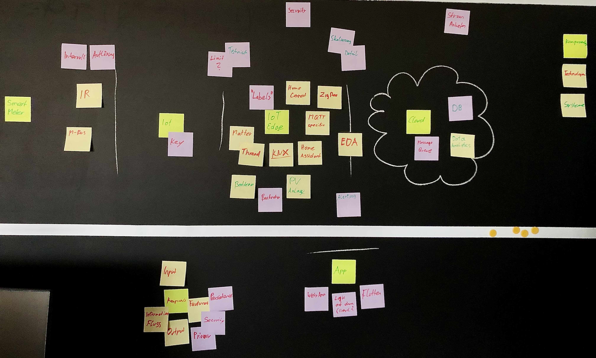
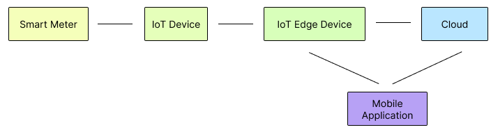

# Open Meter Data Platform Overview

The **Open Meter Data Platform** is a solution designed to standardize a platform to collect smart meter data. This data can be used to optimize energy consumption and enhance efficiency in residential and commercial settings. Leveraging advanced technologies, this system offers real-time monitoring, data analysis, and visualization capabilities. 

## Requirements Notation

The key words "MUST", "MUST NOT", "REQUIRED", "SHALL", "SHALL NOT", "SHOULD", "SHOULD NOT", "RECOMMENDED", "MAY", and "OPTIONAL" in this document are to be interpreted as described in [RFC2119](https://www.rfc-editor.org/rfc/rfc2119).

## Parts of the Specification

This specification is divided into a structure containing 4 parts. Each part has a specific role and a small introduction and overview section.

### [System Overview](1_SystemOverview/overview.md)

In this chapter the specification will give a small overview over the necessary components for building such a system. Specific implementations of the platform may differ from this recomendations.

### [Data Model](2_DataModel/overview.md)

In this section the data model is described. The Data Transmission Format was inspired by a project from the Swedish Defence Materiel Administration.

### [Communication](3_Communication/overview.md)

The communication from the SmartMeter to the Cloud is specified in this chapter.

### [Cloud Interfaces](4_CloudInterfaces/overview.md)

Which interfaces must be available and which of them are just recommended is descibed in this chapter of the specification.

---

<<<<<<<<<  REMOVE THE PART BELOW?? >>>>>>>>>>>>

Here's an overview of the key components and their interconnections:

## Brainstorming

## Architecture

There are different approaches to structure the architecture of such a _Open Meter Data Platform_ This part of the document should provide different approaches to structure the application. The most split up option which we call _Completely Divided Architecture_ is provided on this page. Every component, better described in this document is visualized in the following figure.

To get a better understanding of the options and modifications that could be usefull this subsection about [architectural options](ArchitecturalOptions.md) was created.

## System Flow

1. **SmartMeters** measure real-time energy consumption and injection in individual households or apartments.
2. **IoT Devices** collect energy data from SmartMeters via the M-Bus interface and transmit it securely to the IoT Edge component.
3. **IoT Edge** processes the received data, performs local analytics, and sends the processed information to the central **Cloud** system for further analysis and storage.
4. The **Visualizing Application (App)** connects to the IoT Edge device to access real-time data and the central **Cloud** system for historical usage patterns and visualizations.
5. Users interact with the **Visualizing Application** to monitor energy consumption, analyze trends, and receive alerts.

For detailed specifications on each component, please refer to the respective pages linked above.
